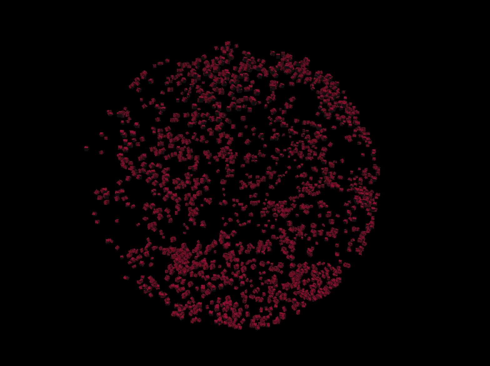
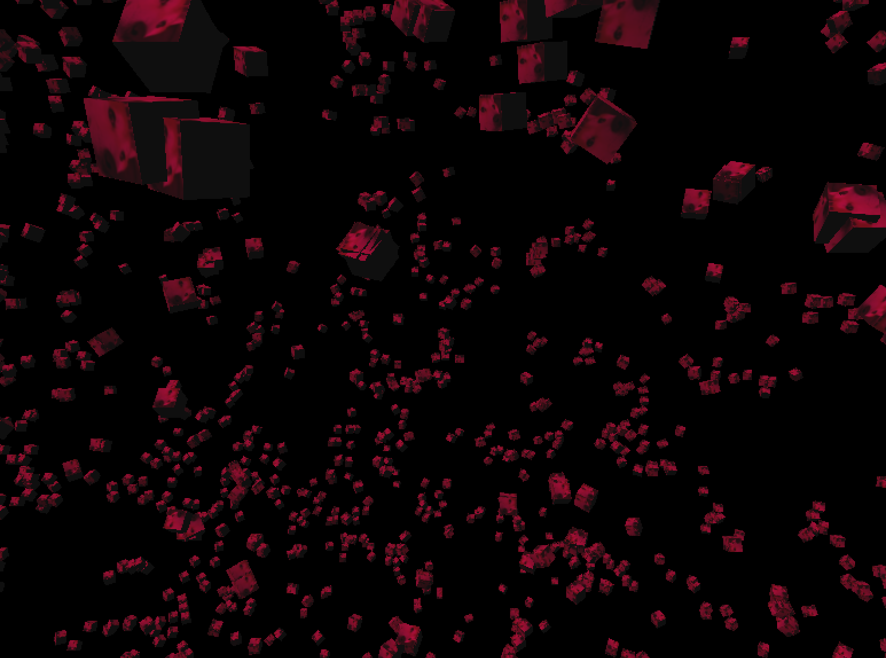
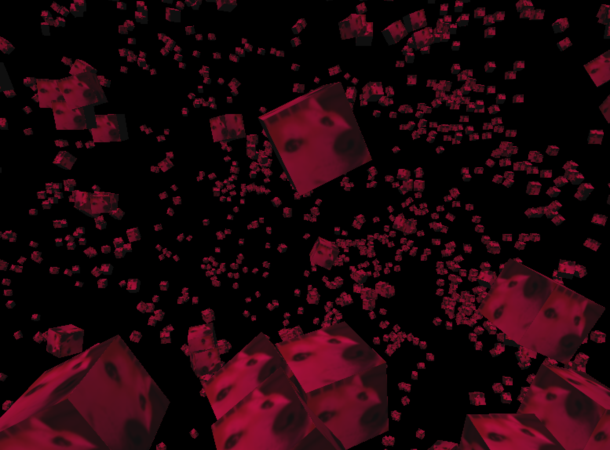

# boids_vk
**boids_vk** is a 3D boids simulation! It is rendered in Vulkan using my other open source rendering framework **[render_thing](https://github.com/not-phoeniix/render_thing)**. The aim of this project is to practice data-oriented design practices to create a complex and efficient simulation of a ***ton of boids***. 

## Screenshots

    
    
    

## Dependencies
All library dependencies are included in the git repo already. The project has been created to support building on Linux using GNU Make. 

The libraries used in this project are as follows:
- render_thing: https://github.com/not-phoeniix/render_thing
- stb_image: https://github.com/nothings/stb
- tinyobjloader: https://github.com/tinyobjloader/tinyobjloader

## License
boids_vk is licensed under the **MIT License**. Please see the [LICENSE](LICENSE) document for more details.
